# Data Lovers
Con 💛 desde Perú y México

**Kamila Ojeda y Berenice Hernández**

***
## Indice

* [Harry Potter's Wizarding World](#✨-harry-potters-wizarding-world-✨)
* [Proceso de creación](#proceso-de-creación)
* [1. Primeros pasos](#1-primeros-pasos)
* [2. Investigación](#2-investigación)
* [3. Historias de Usuario ](#3-historias-de-usuario)
* [4. Diseño](#4-diseño)
* [5. Flujo de trabajo Git y GitHub](#5-flujo-de-trabajo-git-y-github)
* [6. Historia de usuario 1 - 4](#6-historia-de-usuario-1)
* [7. Pruebas unitarias]()
* [8. Deploy]()


***
# ✨ Harry Potter's Wizarding World ✨

Página web donde cualquier usuario puede consultar información relacionada al mundo mágico de Harry Potter, famosa saga escrita por J.K. Rowling.

Encontrarás datos sobre:

- Personajes

Próximamente
- Libros
- Hechizos
- Posiones
- Datos curiosos

Los datos contenidos en el sitio están **basados estrictamente en los libros**, por lo tanto, las imagenes que se visualizan son aquellas realizadas por fans y no encontraras información sobre las películas.

***

## 👩🏻‍💻☕Proceso de creación ☕👩🏻‍💻

***

## **1. Primeros pasos**
* **Presentación**

Este proyecto se trabajó en duplas, por lo que antes de empezar a trabajar, nos presentamos. 

Conocer nuestros hábitos de estudio, tiempo disponible, expectativas, fortalezas y areas de oportunidad fueron factores claves para comprender a la otra y relacionarnos desde el respeto y la empatía. Este primer paso fue de los mas importantes. 

* **Organización**

Este fue un tema clave tambien para empezar, usabamos herramientas distintas para la organización de nuestros proyectos, pero una vez que presentamos las bondades que cada una de estas ofrecía optamos por utilzar ambas. 

  ✍🏻 **Notion** para hacer el vaciado de ideas y concentrado de información por sprint, incluyendo las reflexiones de cada ceremonia. 

  📅 **Trello** nos ayuda a organizar nuestro sprint, básicamente es en donde está nuestro planning. 

* **Elección de temática**

Elegimos trabajar con la data de ***✨Harry Potter✨*** ya que ambas estamos mas familiarizadas con el tema y nos interesó conocer mas acerca de los datos contenidos en los libros .

## **2. Investigación**
En este paso nos apoyamos de la información contenida en el repositorio original del proyecto. Adicional nos dimos a la tarea de invesigar en redes sociales tales como **Facebook** y **YouTube** sobre qué hablan o esciben los y las fans de esta saga, las preguntas base fueron las siguientes:

- ¿Quiénes son los principales usuarios de producto?
- ¿Cuáles son los objetivos de estos usuarios en relación con el producto?
- ¿Cuáles son los datos más relevantes que quieren ver en la interfaz y por qué?
- ¿Cuándo utilizan o utilizarían el producto?

Cabe mencionar que nos encontramos con algunos sitios ya existentes que nos ayudaron con inspiración sobre la forma de presentar el contenido.

* [harrypotter.fandom.com](https://harrypotter.fandom.com/wiki/Main_Page)
* [wizardingworld.com](https://www.wizardingworld.com/)
* [startingharrypotter.com](https://www.startingharrypotter.com/)

## **3. Historias de Usuario**
En esta parte del proceso nos encontramos con una actividad desconocida, fue de los partes que nos llevo mas tiempo construir. 

De incio nos documentamos de manera individual y revisiones en conjunto sobre el tema de la creacion de historias de usuario, criterios de aceptación, definición de terminado y división de historias de usuario en tareas. Las fuentes de las que nos apoyaron fueron, principalmente videos de YouTube y la guía que nos proporcionó Laboratoria:

* [How to create User Stories in Scrum](https://www.youtube.com/watch?v=ky6wFiF5vMk)
* [HOW TO DIVIDE USER STORIES INTO TASKS](https://www.youtube.com/watch?v=Ueq786iZ30I)
* [Guía para DataLovers](https://docs.google.com/presentation/d/e/2PACX-1vQhx9D36NjpH-Daea-ITPUDUzNL8ZiNAprq_7b5PSUrfutk45tEtaOLz2lmd8f54_5jX1hypDM8f8SM/pub?start=false&loop=false&delayms=60000&slide=id.g3ebf713c66_1_55)

Después de la revisión de la teórica sobre Historias de Usuario, nos dimos a la tarea de escribir las nuestras, al final tomamos una OH con un coach que nos dejó mas claro el tema. Finalmente, y considerando que **la mayor parte de la data es sobre los personajes** (Characters),  nuestras HU quedan de la siguiente forma:
***

    HU 1

    Yo como: usuaria fan de Harry Potter
    Quiero: una lista de personajes de toda la saga
    Para: conocer su nombre

    Criterios de aceptación:
    - La usuaria ve la pantalla principal vacía
    - La usuaria puede dar click al botón
    - La usuaria puede visualizar una lista de todos los personajes de la saga
    - Cada personaje se presenta con un distintivo de la casa a la que pertenecen

    Definción de terminado:
    * Uso de HTML semántico
    * Uso de selectores en CSS
    * Diseño responsivo
    * Uso de métodos y objetos en JS
    * Uso de métodos de arrays
    * Pruebas unitarias
    * Proyecto cargado en git y GitHub
***
    HU 2

    Yo como: usuaria fan de HP
    Quiero: poder buscar personajes por nombre y/o apellido
    Para: hacer mas rápida la localización de cada uno

    Criterios de aceptación:
    - La usuaria tiene un input donde puede escribir
    - La usuaria puede escribir en mayúscula y/o minúscula
    - La usuaria visualiza en tiempo real los personajes que coinciden con lo que escribe

    Definción de terminado:
    * Uso de HTML semántico
    * Uso de selectores en CSS
    * Diseño responsivo
    * Uso de métodos y objetos en JS
    * Uso de métodos de arrays
    * Pruebas unitarias
    * Proyecto cargado en git y GitHub
***
    HU 3

    Yo como: usuaria fan de HP
    Quiero: poder ordenar los personajes de forma alfabética
    Para: ver la lista de personajes en orden ascendente y descendente

    Criterios de aceptación:
    - La usuaria puede ver un botón para ordenar
    - La usuaria al darle click al boton ordenar puede ver opcion Ascendente y opción Descendente
    - Al darle click en Ascendente se muestran los personajes ordenados alfabéticamente por nombre de la A a Z
    - Al darle click en Descendente se muestran los personajes ordenados alfabéticamente por nombre de Z a A

    Definción de terminado:
    * Uso de HTML semántico
    * Uso de selectores en CSS
    * Diseño responsivo
    * Uso de métodos y objetos en JS
    * Uso de métodos de arrays
    * Pruebas unitarias
    * Proyecto cargado en git y GitHub
***
    HU 4

    Yo como: usuaria fan de HP
    Quiero: contadores de los personajes mostrados
    Para: saber cuantos personajes se muestran en pantalla, cuántos hombres y cuántos mujeres

    Criterios de aceptación:
    - La usuaria ve en pantalla el numero total de personajes mostrados
    - La usuaria ve el numero total de personajes mujeres
    - La usuaria ve el numero de personajes hombres
    - Los contadores se actualizan automáticamente cuando se usa el buscador

    Definción de terminado:
    * Uso de HTML semántico
    * Uso de selectores en CSS
    * Diseño responsivo
    * Uso de métodos y objetos en JS
    * Uso de métodos de arrays
    * Pruebas unitarias
    * Proyecto cargado en git y GitHub
***

### **4. Diseño**
Luego de terminar de escribir nuestras historias de usuario nos dimos a la taea de crear un pequeño sistema de diseño:

#### ***Paleta de colores***
Buscando un poco de inspiración en sitios como Pinterest, los colores base fueron tomados principalmente de esta imagen:

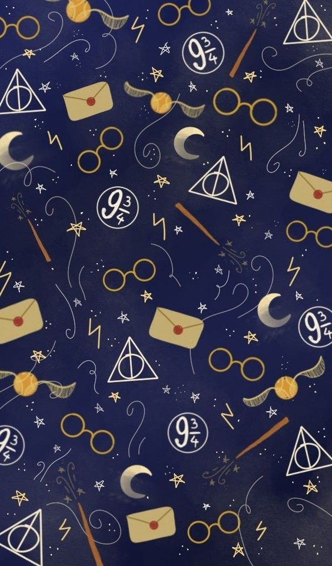

    --main-color: #212342;
    --secondary-blue: #4E4C75;
    --titles-color: #C2B091;
    --content-color: #fff1d9;
    --secundary-color: #e8e9f8;

Los colores adicionales elegidos para relacionarlos con cada casa de estudio de Hogwarts fueron:

    --gryffindor-color: #740001;
    --slytherin-color: #2A623D;
    --ravenclaw-color: #728DDA;
    --hufflepuff-color: #F0C75E;

#### ***Fuentes***
Obetenidas de [Google Fonts](https://fonts.google.com/):
* Fuente principal: [Berkshire Swash](https://www.notion.so/Fuentes-d497c8aec554465784e5eb50c206ec6b#c8e6a5b8dfec40ca95227d3b8e27d21d)
para títulos y subtítulos
* Fuente secundaria: [Josefine Sans](https://www.notion.so/Fuentes-d497c8aec554465784e5eb50c206ec6b#85c097fd38034ae7bf0f11ad01020b2d) para textos descriptivos, parrafos, etc.

#### ***Sketchs***
La recomendación fue entregar un sitio resposivo por lo que nos basamos en la estrategia de diseño ***Mobile First***.

Tomamos papel y lápiz para poner nuestras primeras ideas sobre cómo nos imaginabamos que se vería nuestro sitio:

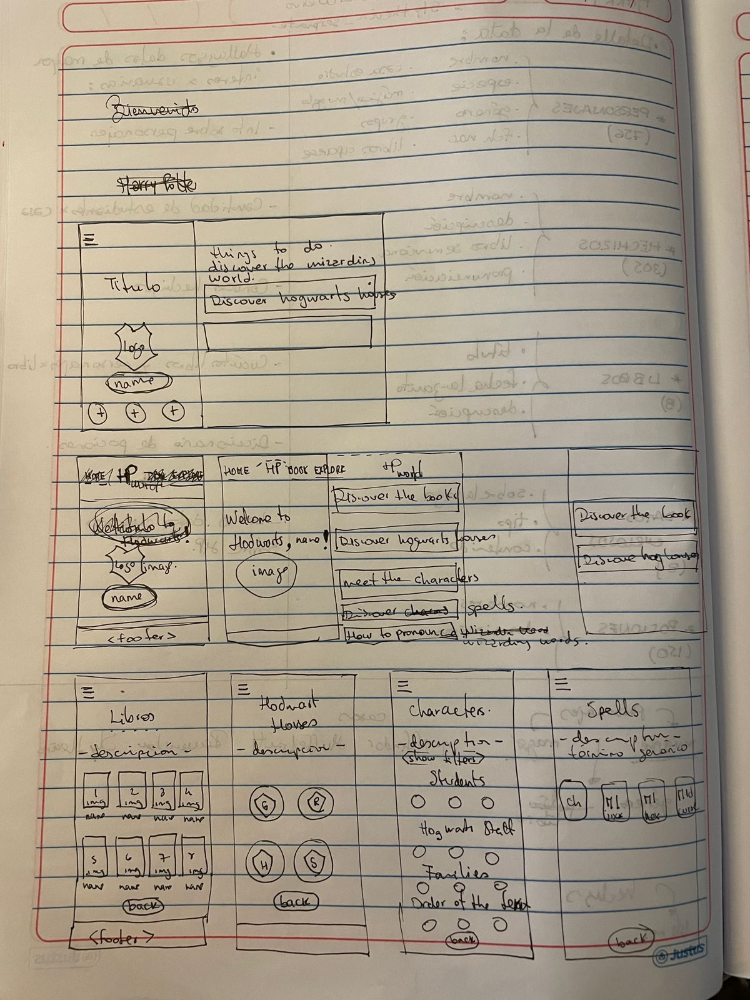
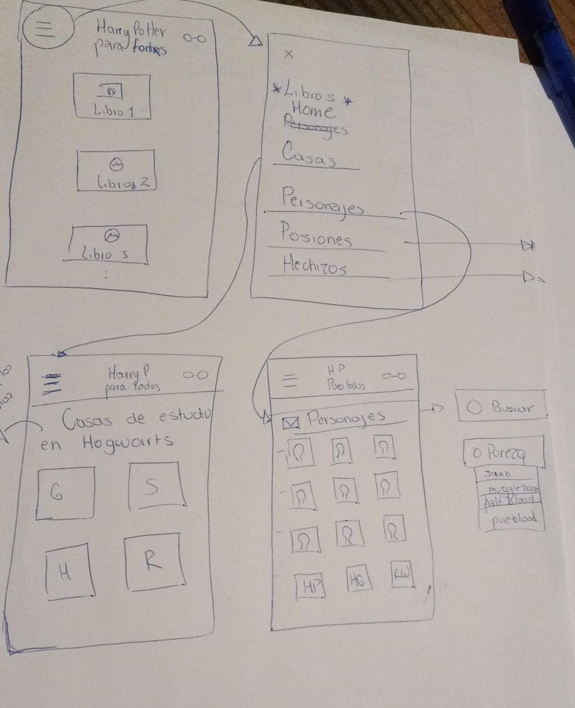

Luego de varias horas, nuestros primeros prototipos en [Figma](https://www.figma.com/file/ex5Lv94vp7sYRK4tTE9SeU/Harry-Potter-Web-Page?node-id=0%3A1&t=ksUvZkhpVimzv2mj-1) lucían así:

* Pantalla de incio/ Menú / Pantalla Characters

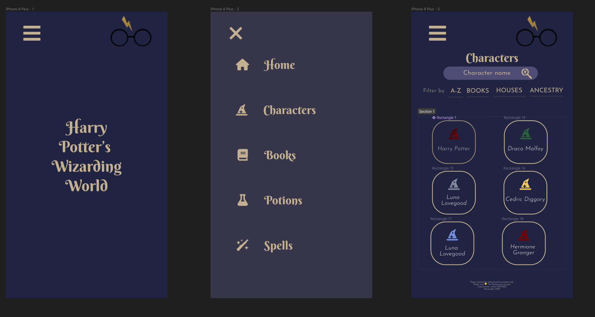

* Pantalla Books / Pantalla Libro 1

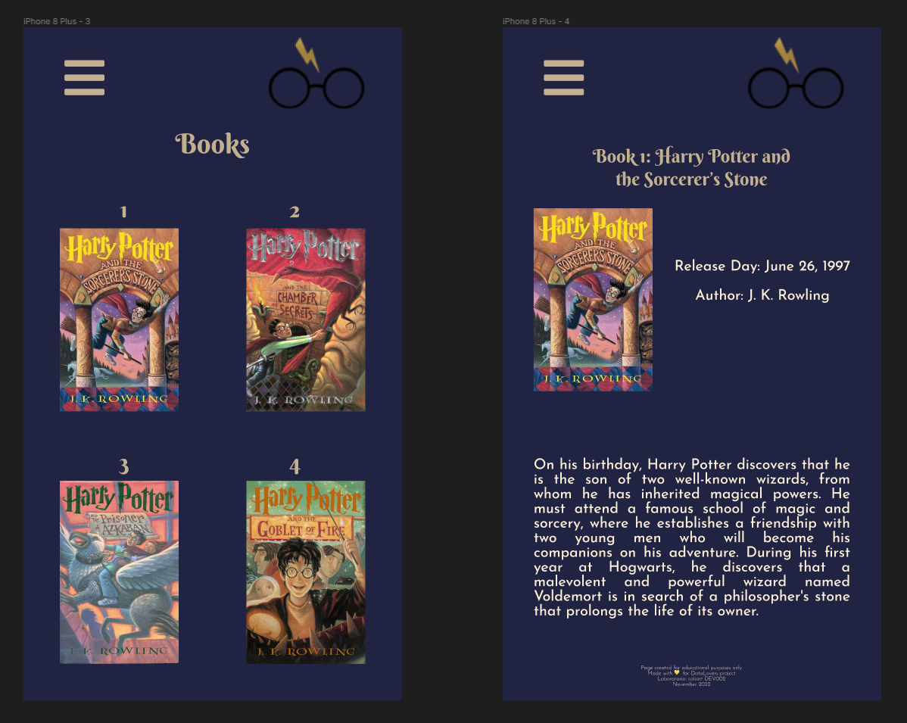

* **Feedback**:
    1. Se puede mejorar las cards, para que sean más llamativas.
    2. El color de los menús.
    3. El color del logo no va con la temática del diseño.


* Pantalla Characters

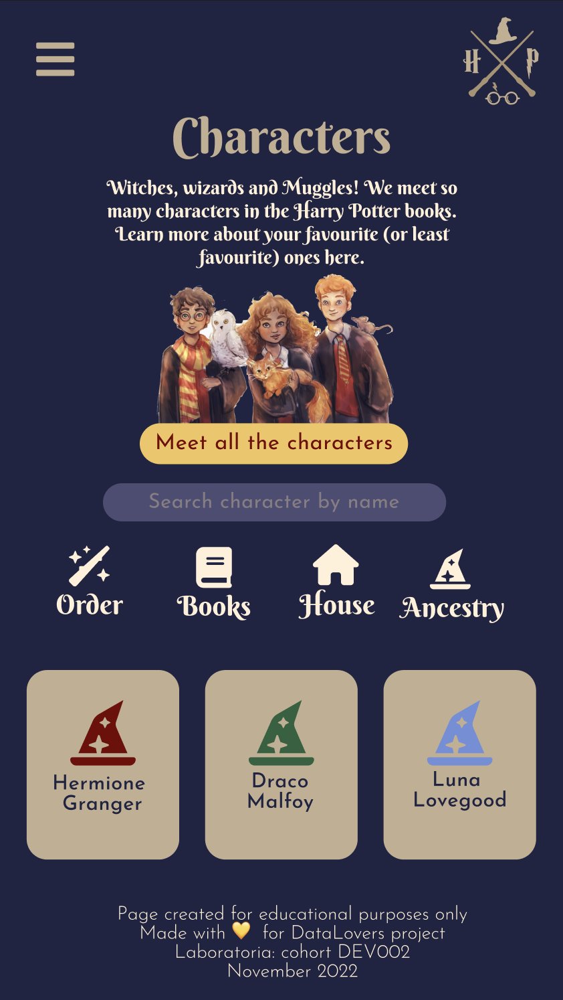

Finalmente como ultima evolución de nuestro prototipo, se agregó una sección para mostar los contadores, mismos que nos ayudarian a completar los objetivos de aprendizaje.

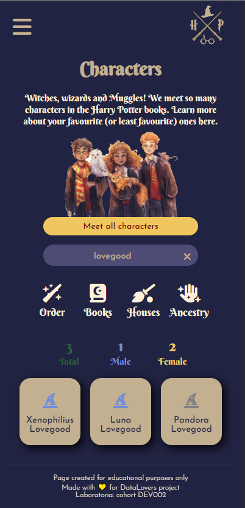
## **5. Flujo de trabajo Git y GitHub**
LLegado el momento de iniciar con el códgio, nos enfrentamos a un nuevo reto, hacer código juntas.
El reto principal fue organizar nuestro flujo de trabajo usando las herramientas como git y github. Esto ha sido un ir y venir lleno de aprendizajes, muchos errores y conflictos, después de iterar, investigar y probar, acordamos seguir el siguiente flujo:

* Flujo que siguió Kami:


* Flujo que siguió Bere:


## **6. Historia de Usuario 1 - 4**
Reflexionando acerca de la primera Historia de Usuario, nos dimos cuenta que para entregar algo funcional y no perder tiempo, era necesario empezar con la pantalla Characters, dado que solo nos concentraríamos en filtrar la data de este array **Characters** en especifico.


## Visualmente (HTML y CSS)

### `src/index.html`

En este archivo va el contenido que se mostrará al usuario (la maquetación).
* Dentro de la etiqueta `<body>` están 3 etiquetas principales
    - `<header>`: la nav bar principal y logo.
    - `<main>`: contenido principal del proyecto.
    - `<footer>`: pie de página del proyecto.

* Dentro de la etiqueta `<main>` están 6 secciones que permiten estructurar la página.

        <section class="text-img-details">: contiene la descripción del tema a filtrar.

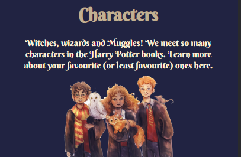

        <section class="button-meet-all-characters">: es el contenedor del boton con el que se muestran todos los personajes.


        <section class="search-wrapper">: es el contenedor del input que tiene la funcion de buscador.


        <section class="container-menu">: contiene la barra de menú desplegable de opciones de filtrado.

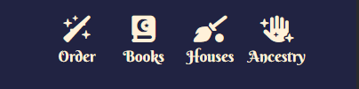

        <section class="container-counter-characters">: el contenedor de los contadores, total, female y male.

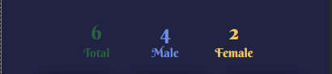

        <section class="cards">: contiene la lista de elementos o cards que muestra el nombre de cada personaje.

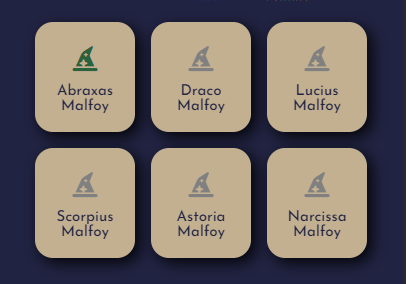

### `src/style.css`

Reseteamos estilos y definimos variables, tanto para colores como para fuentes:

```
* {
    margin: 0;
    padding: 0;
    box-sizing: border-box;
}

:root {
    --main-color: #212342;
    --secondary-blue: #4E4C75;
    --titles-color: #C2B091;
    --gryffindor-color: #740001;
    --slytherin-color: #2A623D;
    --ravenclaw-color: #728DDA;
    --hufflepuff-color: #F0C75E;
    --titles-font: 'Berkshire Swash', cursive;
    --secondary-font: 'Josefin Sans', sans-serif;
}

````
Nos apoyamos con Flexbox para el tema del diseño responsivo y el acomodo de las cards que contienen el nombre de cada personaje.

Los **media queries** fueron aplicados en:

```
@media only screen and (max-width: 700px)
@media only screen and (max-width: 500px)
@media only screen and (max-width: 350px)

```


## Funcionalmente (JavaScript)

Tal como lo indica el README del proyecto, dividimos el código JavaScript en 2 archivos:
### `src/data.js`
Donde se encuentran las funciones de filtrado de la data.

Ejemplos:

```
export const getCharactersFrom = (data) => {
  if (data === undefined) {
    throw new TypeError('data is undefined')
  } else if (data === null) {
    throw new TypeError('data is null')
  } else {
    return(data.characters);
  }
}

export const filterCompare = (array, cName) => {
  if (array === undefined || cName === 0) {
    throw new TypeError('data is undefined')
  } else if (array === null || cName === null) {
    throw new TypeError('null values')
  } else {
  let comparedElements = array.filter(element => element.name.toLowerCase().includes(cName.toLowerCase().trim()));
  return comparedElements;
}

```

### `src/main.js`
Aqui mandamos llamar las funciones creadas en *data.js* y manipulamos el DOM para presentar esa información en la UI.

Por ejemplo:

```

import {
    getCharactersFrom,
    createArrayObjects,
    filterCompare,
    filterAscendent,
    filterDescendent,
    countMale,
    countFemale,
} from "./data.js";


function createCharacterCard(elements) {
    elements.forEach((element) => {
        let li = document.createElement("li");
        let span = document.createElement("span");
        let i = document.createElement("i");
        let p = document.createElement("p");

        li.className = "card-element";
        p.innerHTML = element.name;
        p.className = "card-p";
        i.className = "fa-solid fa-hat-wizard";
        i.id = "span-i";
        span.className = "card-span";

        if (element.house == "Gryffindor") {
            span.style.color = "#740001";
        } else if (element.house == "Hufflepuff") {
            span.style.color = "#F0C75E";
        } else if (element.house == "Slytherin") {
            span.style.color = "#2A623D";
        } else if (element.house == "Ravenclaw") {
            span.style.color = "#728DDA";
        } else {
            span.style.color = "gray";
        }

        list.appendChild(li);
        li.appendChild(span);
        span.appendChild(i);
        li.appendChild(p);
    });
}

function searchRealTime() {
    let cName = searchInput.value;
    list.innerHTML = "";
    let elements = filterCompare(data.characters, cName);
    printElements(elements);
}
```
### **7. Pruebas unitarias**

Cada función que fue creada en data.js para manipular la data fue testeada con pruebas unitarias. Apoyándonos del framework Jest, implementamos un total de 21 pruebas, 3 por cada función.

Aquí los resultados que se obtienen:

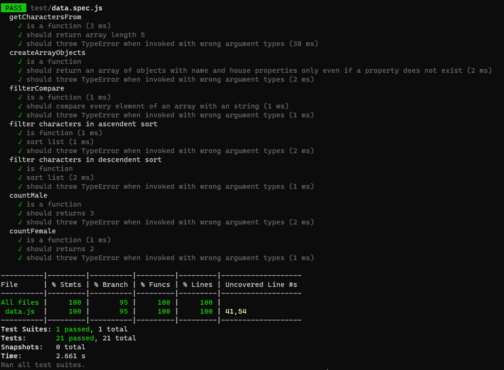

Por ejemplo, para nuestra funcion que compara el valor que es introducido en el input del buscador con el array de personajes para mostrar las coincidencias, se tienen las siguientes pruebas:

1. Validar que sea una función.
2. Validar que nos arroje un(os) elemento(s) especifico(s) del array de acuerdo a un valor dado.
3. Valida el manejo de errores

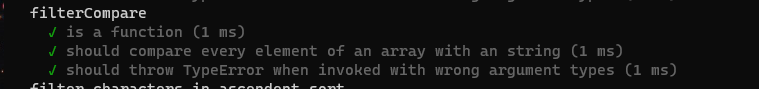

```
describe ('filterCompare', () => {
  it('is a function', () => {
    expect(typeof(filterCompare)).toBe('function')
  });

  it('should compare every element of an array with an string', () => {
    expect(filterCompare(array, 'euan')).toEqual([
      {
        house: 'Gryffindor' ,
        name: "Euan Abercrombie"
      }
    ])

    expect(filterCompare(array, 'ZOO')).toEqual(
      [
      {
        house: null,
        name: "Zoo director"
      }
      ])
    
    expect(filterCompare(array, 'A')).toMatchObject([
      {house: "Gryffindor",name: "Euan Abercrombie"}, 
      {house: "Hufflepuff", name: "Silvanus Kettleburn"},
      {house: undefined, name: "Aged witch" },
      {house: "Slytherin", name: "Mafalda"}
    ])
  });

  it('should throw TypeError when invoked with wrong argument types', () => {
    expect(() => filterCompare(undefined,0)).toThrow(TypeError);
    expect(() => filterCompare(null,null)).toThrow(TypeError);
  })
});

```


Es importatante mencionar que para aplicar los test a las funciones, no se usó toda la data que se tenía, sino solo una fracción del array con algunos objetos:

```
const data = 
  {
    characters: [
      {
        "id": 1,
        "name": "Euan Abercrombie",
        "birth": "between 1 September 1983 and 31 August 1984",
        "death": null,
        "species": "Human",
        "ancestry": null,
        "gender": "Male",
        "hair_color": null,
        "eye_color": null,
        "wand": null,
        "patronus": null,
        "house": "Gryffindor",
        "associated_groups": ["Hogwarts School of Witchcraft and Wizardry", "Gryffindor"],
        "books_featured_in": [5]
      },
      {
        "id": 231,
        "name": "Silvanus Kettleburn",
        "birth": "22 November, before 1927[citation needed]",
        "death": "Between 2 May, 1998 and 22 November, 2014",
        "species": "Human",
        "ancestry": "Pure-blood or half-blood",
        "gender": "Male",
        "hair_color": "Silver",
        "eye_color": "Brown",
        "wand": "Chestnut and phoenix feather, 11½\", whippy",
        "patronus": null,
        "house": "Hufflepuff",
        "associated_groups": ["Hogwarts School of Witchcraft and Wizardry", "Hufflepuff", "Kettleburn family"],
        "books_featured_in": [3]
      },
      {
        "id": 496,
        "name": "Zoo director",
        "birth": null,
        "death": null,
        "species": "Human",
        "ancestry": "Muggle",
        "gender": "Male",
        "hair_color": null,
        "eye_color": null,
        "wand": null,
        "patronus": null,
        "house": null,
        "associated_groups": ["Zoo"],
        "books_featured_in": [1]
      },
      {
        "id": 618,
        "name": "Aged witch",
        "birth": null,
        "death": null,
        "species": "Human",
        "ancestry": null,
        "gender": "Female",
        "hair_color": null,
        "eye_color": null,
        "wand": null,
        "patronus": null,
        // "house": null,
        "associated_groups": ["Knockturn Alley"],
        "books_featured_in": [2]
      },
      {
        "id": 630,
        "name": "Mafalda",
        "birth": "between 1 September 1982 and 31 August 1983, Great Britain or Ireland",
        "death": null,
        "species": "Human",
        "ancestry": "Muggle-born or Half-blood (possibly)",
        "gender": "Female",
        "hair_color": null,
        "eye_color": null,
        "wand": null,
        "patronus": null,
        "house": "Slytherin",
        "associated_groups": ["Prewett family", "Weasley Family", "Slytherin", "Hogwarts School of Witchcraft and Wizardry"],
        "books_featured_in": [4]
      }
    ]
  }

```


### **8. Deploy**

El proyecto se llevo a cabo en duplas, durante el desarrollo del mismo se trabajó con un flujo establecido para tener solo una rama principal a la que se enviaban los cambios finales de ambas, tal como se especifica en la sección [5. Flujo de trabajo Git y GitHub](#5-flujo-de-trabajo-git-y-github). 

Para el deploy, cada una lo realizó desde su repositorio remoto.

### 👩🏻‍💻 Kamila Ojeda

* GitHub: [kamojeda/DEV002-data-lovers](https://github.com/kamojeda/DEV002-data-lovers)
* Deploy: [✨Harry Potter's Wizarding World✨]()

### 👩🏻‍💻 Berenice Hernández

* GitHub: [beresdev/DEV002-data-lovers](https://github.com/beresdev/DEV002-data-lovers)
* Deploy: [✨Harry Potter's Wizarding World✨]()
